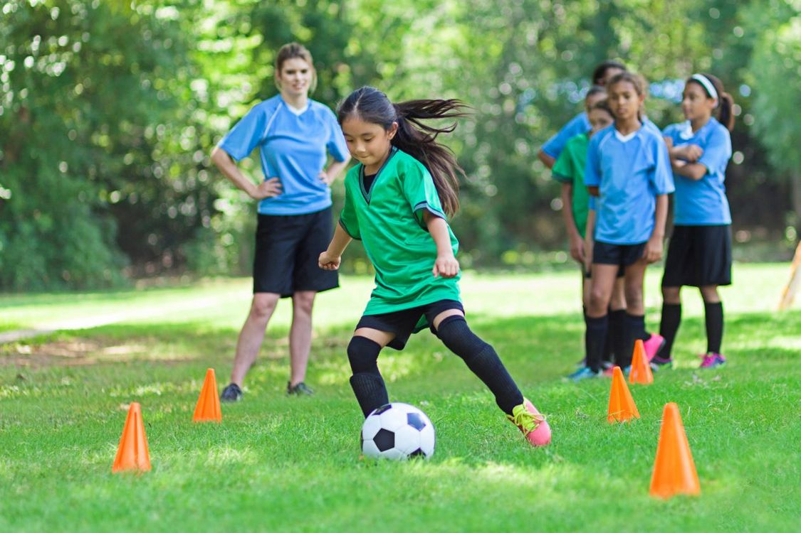

# Image Captioning using Attention Mechanism

## Introduction

This project aims to build an image captioning model using a combination of Convolutional Neural Networks (CNN) and Recurrent Neural Networks (RNN) with an attention mechanism. The model takes an image as input and generates a caption that describes the contents of the image.



## Dependencies

- TensorFlow 2.x
- Matplotlib
- TensorFlow Datasets

## Model Architecture

### Encoder

The encoder uses a pre-trained InceptionResNetV2 model to extract features from the input image. These features are then passed to a dense layer to transform them into a fixed-size vector.

### Decoder

The decoder is an RNN model that uses a GRU layer and an attention mechanism. The attention mechanism allows the model to focus on specific parts of the image when generating each word of the caption.

## How to Run

1. Clone the repository.
2. Run the Jupyter notebook `image_captioning.ipynb`.

## Example Usage

```python
filename = "sample_images/sport.jpg"
img = tf.image.decode_jpeg(tf.io.read_file(filename), channels=img_channels)
plt.imshow(img)
plt.axis("off")

for i in range(5):
    caption = captioning(img)
    print(" ".join(caption[:-1]) + ".")
```

## License

MIT License

